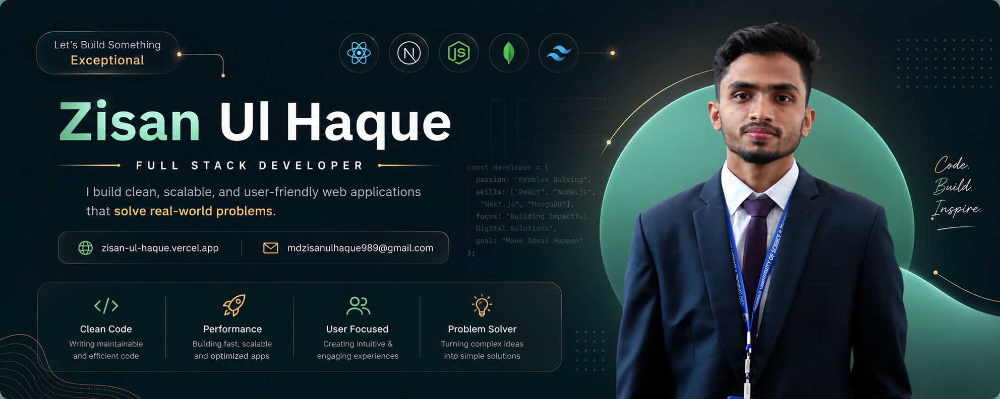

<h1 align="center">Hey there! 👋 I'm Md. Zisan Ul Haque</h1>

<h3 align="center">
Full Stack Developer • MERN Stack Developer
</h3>

I'm a software engineer from Bangladesh passionate about building scalable applications,high-performance distributed systems..

My core expertise includes <strong>TypeScript, Next.js, React, Node.js, Prisma, PostgreSQL, System architecture</strong>. I enjoy designing systems that are reliable, cost-efficient, and production-ready.

Over the years, I've developed projects ranging from <strong>scalable web applications</strong> and <strong>responsive frontend experiences</strong> to <strong>robust backend systems</strong> and <strong>payment-enabled platforms</strong>.

🚀 A few things I love building:

<ul>
  <li><strong>Full-Stack Web Applications</strong> using React, Next.js, Node.js, Express.js, and TypeScript.</li>

  <li><strong>Scalable Backend Systems</strong> with REST APIs, Prisma ORM, PostgreSQL, MongoDB, authentication, and role-based access control.</li>

  <li><strong>Modern User Interfaces</strong> that are responsive, accessible, and designed with Tailwind CSS for a seamless user experience.</li>

  <li><strong>Real-Time Applications</strong> powered by Socket.IO for live updates, notifications, and interactive user experiences.</li>

  <li><strong>Secure Payment & Business Solutions</strong> by integrating payment gateways like SSLCommerz and building production-ready web platforms.</li>
</ul>

I enjoy transforming ideas into real-world products, writing clean and maintainable code, and continuously learning modern technologies to build scalable, high-quality applications.

## Connect with me

 &nbsp;
 &nbsp;
 &nbsp;
 &nbsp;

### Projects

| Name             | Description             | Project Link    | Video Link     |
| ---------------- | ----------------------- | --------------- | -------------- |
| [PROJECT 1 NAME] | [PROJECT 1 DESCRIPTION] | [Github]([URL]) | [Video]([URL]) |
| [PROJECT 2 NAME] | [PROJECT 2 DESCRIPTION] | [Github]([URL]) | [Video]([URL]) |
| [PROJECT 3 NAME] | [PROJECT 3 DESCRIPTION] | [Github]([URL]) |                |
| [PROJECT 4 NAME] | [PROJECT 4 DESCRIPTION] | [Github]([URL]) |                |
| [PROJECT 5 NAME] | [PROJECT 5 DESCRIPTION] | [Github]([URL]) |                |

### Cloud, DevOps and Testing

 &nbsp;
 &nbsp;
 &nbsp;
 &nbsp;
 &nbsp;
 &nbsp;

### Database

 &nbsp;
 &nbsp;
 &nbsp;
 &nbsp;
 &nbsp;
 &nbsp;

### Programming Languages

 &nbsp;
 &nbsp;
 &nbsp;
 &nbsp;
 &nbsp;

### Frontend

 &nbsp;
 &nbsp;
 &nbsp;
 &nbsp;
 &nbsp;
 &nbsp;  
 &nbsp;
 &nbsp;
 &nbsp;

### Backend

 &nbsp;
 &nbsp;
 &nbsp;
 &nbsp;
 &nbsp;

### Tools and Others

 &nbsp;
 &nbsp;
 &nbsp;
 &nbsp;
 &nbsp;
 &nbsp;
 &nbsp;

  
  

  

